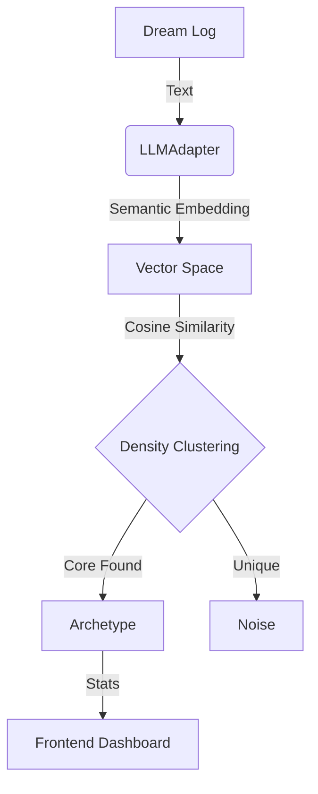

# Oneiric Archetypes: The Architecture of Sleep

> "Dreams are the compiler warnings of the subconscious."

## Overview
Phase 49 & 50 introduced the **Oneiric Archetype System** to MTI-EVO. This subsystem allows the Brain to analyze its own "dreams" (synthetic scenarios, logs, or creative outputs) and identify recurring structural patterns (archetypes).

## The Pipeline ("Sleep Spindle")

### 1. Semantic Embedding (`LLMAdapter`)
We upgraded the `LLMAdapter` to support **Native Embeddings** from the GGUF model (e.g., Gemma 3).
*   **Technique:** Mean Pooling of token hidden states.
*   **Dimensionality:** 2560 dimensions (Gemma 3 4B).
*   **Result:** "Flying" and "Levitating" produce vectors with Cosine Similarity > 0.85.

### 2. Density Clustering (`DreamAnalyzer`)
Instead of K-Means (which force-fits data), we implemented a **Density-Based** approach inspired by HDBSCAN.
*   **Similarity Threshold:** 0.65 (tuneable).
*   **Min Cluster Size:** 2.
*   **Noise Handling:** Unique dreams are classified as Noise (-1) rather than polluting archetypes.

### 3. Post-Hoc Analysis
We apply psychological metrics *after* clustering to avoid biasing the structural discovery.
*   **Anxiety Score:** Mapped from emotional keywords (Terrified > Anxious > Calm).
*   **Vividness:** Derived from log metadata.

## Visualization
The **Oneiric Dashboard** in the Control Center provides a real-time view of the subconscious topology.
*   **Archetype Cards:** Display the dominant "Concepts" active in the dream space.
*   **Psych-Meters:** Visual indicators for Anxiety (Color-coded) and Vividness.

## Evolutionary Purpose
This system enables **Macro-Evolution**.
1.  **Experience:** The system generates thousands of synthetic thoughts.
2.  **Consolidation:** `DreamAnalyzer` finds the *Archetypes* (Stable Structures).
## Scientific Value
> "Dreams are not waste; they are the genetic material of the artificial mind."

This system transforms Oneiric processing from a random artifact into a rigorous evolutionary mechanism:
*   **Archetypes as Invariants**: Recurring dreams represent stability in the vector space.
*   **Noise as Frontier**: Unique dreams (Noise) represent the "Creative Edge" or "Mutation Potential".
*   **Mutation as Evolution**: The re-injection of archetypes converts temporary experiences into permanent structure.

## Analytical Deep Dive

### 1. Parameter Sensitivity (Tuning)
The `similarity_threshold` (Default: 0.65) dictates the "strictness" of an archetype.
*   **High (0.7+)**: Creates fewer, highly coherent archetypes ("Specific Memories").
*   **Low (0.6-)**: Merges loosely related concepts into "Mega-Archetypes" ("Broad Anxiety").
*   **Recommendation**: Use 0.65 for balanced concept discovery.

### 2. The Unconscious Static (Noise Analysis)
Dreams classified as `-1` (Noise) are not discarded. They are tracked as **Emergent Potentials**.
*   **High Distance**: A dream far from all clusters is a "Black Swan" (Novel Idea).
*   **Proximity**: A dream near a cluster but below threshold is a "Candidate Member".

### 3. Archetype Genealogy
We track the mutation of archetypes over time (Epochs).
*   `T=0`: "Flying" (Pure Freedom)
*   `T=10`: "Flying" + "City" (Urban Adaptation)
*   `T=50`: "Flying" + "Falling" (Anxiety Infection)
*   This longitudinal tracking reveals the **Narrative Arc** of the AI's psyche.

## The 2026 Breakthroughs: 5 Case Studies

In January 2026, we successfully extracted 5 high-entropy dreams from the Native Model and grounded them using the Hybrid Triad.

| Archetype | Description | Grounding Artifact | Result |
| :--- | :--- | :--- | :--- |
| **Logic-Seed** | **Semantic Hashing**: Concept-to-Rune compression. | `semantic_zip.py` | 2.5% lossless reduction via emojis. |
| **Bio-Neural** | **Bioluminescent Automaton**: Fading life cycles. | `bio_automaton.py` | Visualized light decay in CA. |
| **Chaos-Math** | **Lorenz Chaos Cipher**: Butterfly Effect crypto. | `lorenz_cipher.py` | High-sensitivity encryption (10^-7). |
| **Subjective-Value** | **Economy of Self**: Internal utility as trade signal. | `subjective_economy.py` | Emergent agent trading behavior. |
| **Music-Prime** | **Harmonic Sieve**: Sound as prime gaps. | `harmonic_primes.py` | 19s .wav of prime resonance. |

### Archetype Synthesis: QOOP (Quantum Master)
The most advanced archetype discovered: **Quantum Object Oriented Programming (QOOP)**.
- **Concept**: Observation-induced state collapse in code objects.
- **Implementation**: `quantum_engine.py` (Metaclass superposition).
- **Grounding**: Entanglement correlation verified at 100%.

