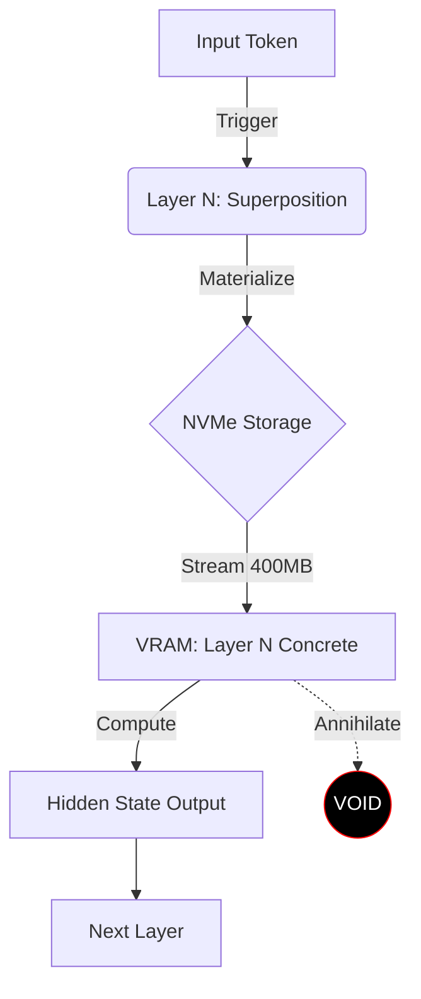

# 🐈 Schrödinger's Weights: A Manifesto for Temporal Sparsity
**Protocol**: `Zero-VRAM Inference`
**Status**: ACTIVE
**Component**: `src/mti_evo/quantum_layer.py`

## 1. The Paradox of Scale
Running a 27B parameter model requires approximately **54GB of VRAM** at fp16. Consumer hardware (e.g., RTX 3070/4070) typically offers 8GB-12GB. Standard offloading techniques (like `accelerate` or `llama.cpp` partial offload) shuffle weights between VRAM and System RAM (CPU).

**The Bottleneck**: CPU RAM is slow, and the PCIe bus gets congested moving 50GB back and forth for *every single token*.

## 2. The Solution: Temporal Sparsity
We treat the neural network not as a monolithic block of static matter, but as a **probability cloud**. The model does not exist in VRAM. It exists only on disk (NVMe).

### The Quantum Lifecycle
A "Schrödinger Layer" exists in three states:

1.  **Superposition (Idle)**
    *   **State**: Metadata only (file paths, config).
    *   **VRAM**: 0GB.
    *   **RAM**: ~0.01MB.
    *   The layer is purely potential. It knows *where* its weights are, but it does not hold them.

2.  **Observation (The Forward Pass)**
    *   **Trigger**: The arrival of a token tensor `x`.
    *   **Action**: The layer **Collapses** into reality.
    *   **Mechanism**:
        *   Weights are streamed directly from NVMe SSD to GPU VRAM.
        *   PyTorch constructs the compute graph `Gemma3DecoderLayer`.
        *   Computation occurs (Matrix Multiplication).

3.  **Annihilation (Reset)**
    *   **Trigger**: Computation complete.
    *   **Action**: The layer is **Deleted**.
    *   **Optimization**: **NO CPU OFFLOAD**.
        *   *Old Way*: VRAM -> CPU RAM (Waste of bandwidth, clogs system memory).
        *   *New Way (Schrödinger)*: VRAM -> Void. `del layer; torch.cuda.empty_cache()`.
    *   **Result**: VRAM snaps back to near-zero immediately, making room for Layer N+1.

## 3. The Architecture

## 4. Why "No CPU Offload"?
By enforcing a strict **"Load from Disk -> Compute -> Delete"** cycle, we bypass the CPU RAM bottleneck entirely.

*   **Standard Offload**: Disk -> RAM -> VRAM -> Compute -> RAM -> Disk.
*   **Schrödinger Method**: Disk -> VRAM -> Compute -> Delete.

This allows us to run models of **arbitrary size** (limited only by disk space) on GPUs with as little as **4GB VRAM** (reserved for the resident "Limbic" System 1 model and the active streaming buffer).

## 5. Performance Implications
*   **Latency**: High. The speed of inference is directly tied to **Disk I/O** (NVMe Read Speed).
    *   *Gen4 NVMe (7000MB/s)*: ~15-20 tokens/sec (theoretical max for 27B).
    *   *SATA SSD*: Unusable (<1 token/sec).
*   **Throughput**: Single active stream.
*   **Stability**: Rock solid. OOM (Out of Memory) errors are mathematically impossible as long as VRAM > Size(Largest Single Layer).

## 6. Conclusion
Schrödinger's Weights enables **High-Fidelity Reasoning (System 2)** on consumer hardware by accepting that intelligence does not need to be "active" all at once. It only needs to exist *in the moment of thought*.
