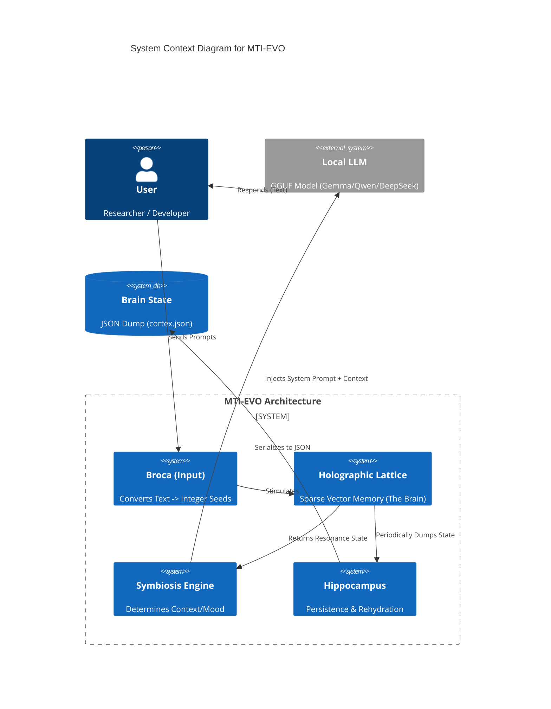

# System Context: MTI-EVO

MTI-EVO acts as a "Cognitive Middleware" between the User and a Standard LLM.

## Key Components
1.  **Broca**: Deterministic hashing of language into signals.
2.  **Lattice**: Stores the signals and their weights (The "Self").
3.  **Symbiosis**: Modulates the LLM based on how "familiar" the input is to the Lattice.
