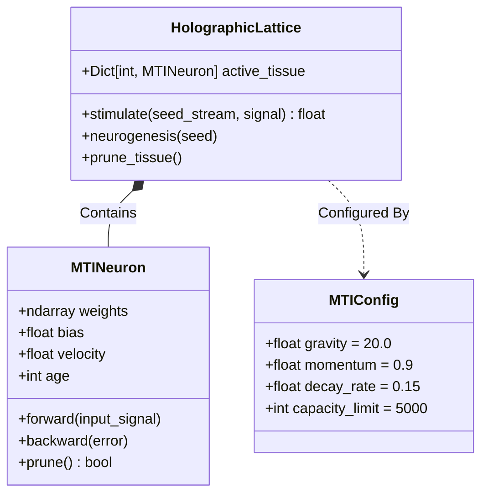

# The Holographic Lattice: Internal Logic

The Core (`src/mti_core.py`) is a pure Python implementation of a sparse biological network.

## The Learning Cycle
1.  **Stimulation**: `stimulate(seeds, 1.0)` is called.
2.  **Lookup**: Lattice checks `active_tissue` (Hash Map).
3.  **Neurogenesis**: If seed is missing, `MTINeuron` is created using `MTIConfig` params.
4.  **Resonance**: `Neuron.forward()` calculates activation.
5.  **Reflex**: If `learn=True`, `Neuron.backward()` applies gradients (Momentum).
6.  **Entropy**: `prune_tissue()` helps the weak die (Gravity).
