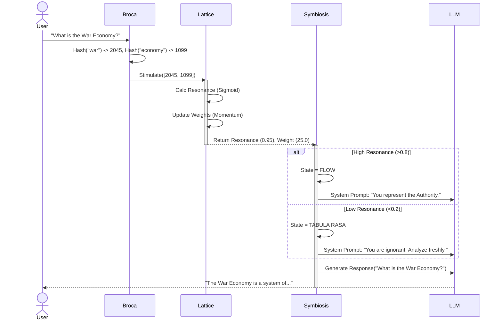

# Data Flow: The Symbiotic Loop

How a user prompt becomes a "Resonant Thought".

## Anti-Hallucination Mechanism
The **Resonance Score** determines the **Authority Level** given to the LLM.
- If the Lattice "Knows" (High Res), the LLM is allowed to be confident.
- If the Lattice "Forgets" (Low Res), the LLM must be humble.
